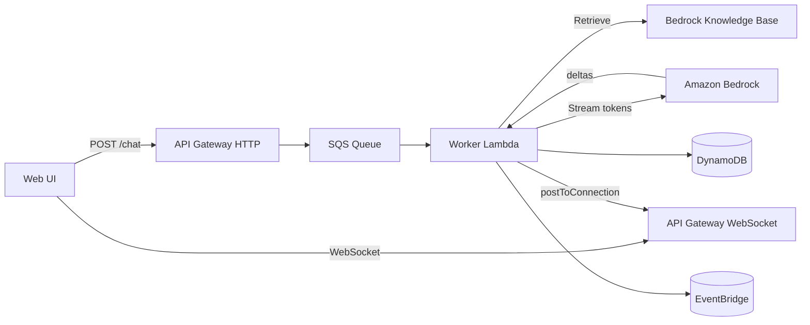
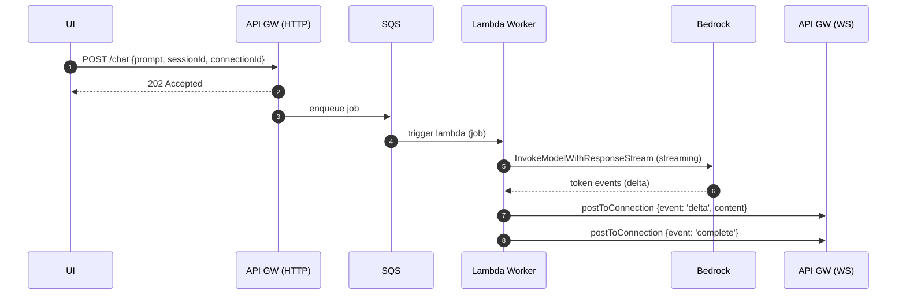

# Architecture Deep Dive

This document explains the end-to-end system, focusing on the **async streaming** flow and **RAG** integration.

## Component view

### Why async?
- Avoids HTTP timeouts for long generations.
- Smoothly scales consumers with Lambda concurrency.
- Enables **token streaming** to clients over WS while work continues in the background.

## Streaming sequence

## Knowledge Bases integration
Two modes:
1. **Managed RAG**: `RetrieveAndGenerate(Stream)` (fast path).
2. **Custom RAG**: `Retrieve` (KB) + craft prompt + `InvokeModelWithResponseStream` (more control).

We implement **Custom RAG** in the POC for stricter prompts and consistent citations.

## Security and governance
- **IAM**: limit Bedrock to specific model ARNs + KB ARN; DDB table-level perms; SQS send/consume.
- **Network**: optionally add VPC + VPC endpoints for Bedrock, S3, and vector store.
- **Audit**: publish events to EventBridge (who asked what, retrieved which docs, latencies).
- **Rate Limiting**: throttle REST POSTs; consider WAF on CloudFront when public.

## Observability
- Track **first-token latency**, Bedrock TPS/throttles, SQS Age, and Lambda cold starts.
- Use CloudWatch dashboards + alarms.
