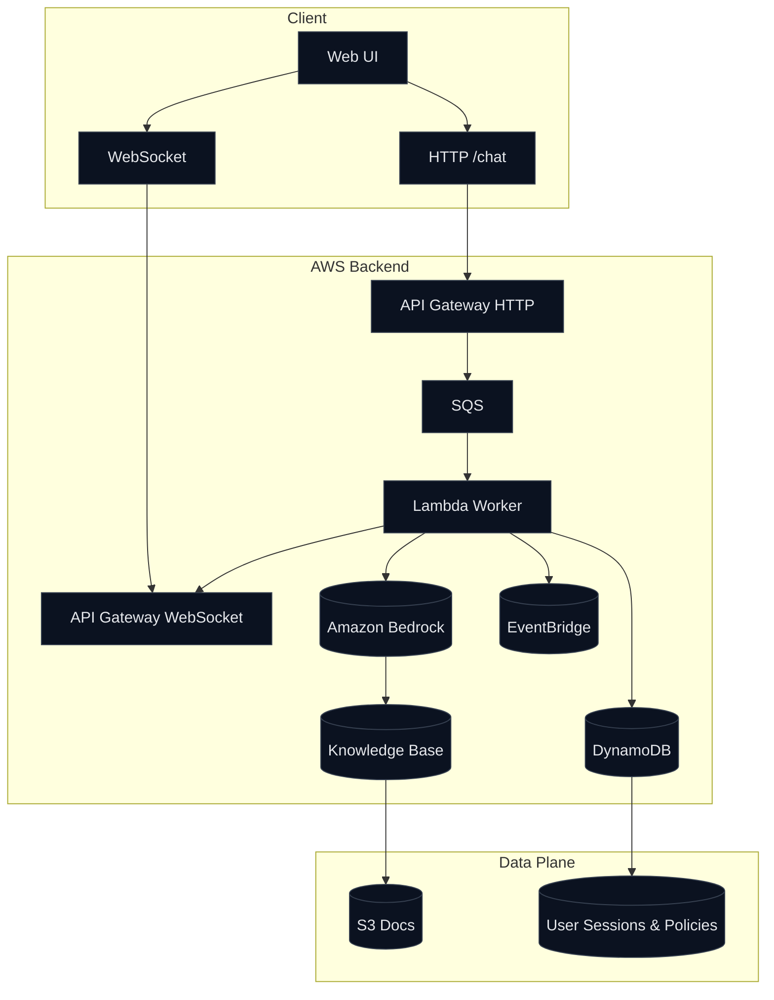

# Bedrock Chatbot: From Prompt to Production

Welcome to **Bedrock Chatbot**, a modern reference architecture for building enterprise-grade generative AI assistants on AWS.

This project combines **Amazon Bedrock**, **Knowledge Bases**, **Cognito**, **API Gateway (HTTP + WebSocket)**, **SQS**, **Lambda**, and **DynamoDB** to deliver **streaming**, **context-grounded** chat experiences.

## Why this matters
- **Real-time streaming** UX using Bedrock’s streaming APIs and WebSockets.
- **RAG** via Bedrock Knowledge Bases for grounded, cited answers.
- **Async scaling** with SQS and Lambda workers.
- **Security & governance**: IAM least privilege, audit with EventBridge, policy store in DynamoDB.

## High-level architecture

## Quick links
- [Architecture Deep Dive](architecture.md)
- [Deployment Guide](deployment.md)
- [Frontend Walkthrough](frontend.md)
- [POC Overview](poc.md)
